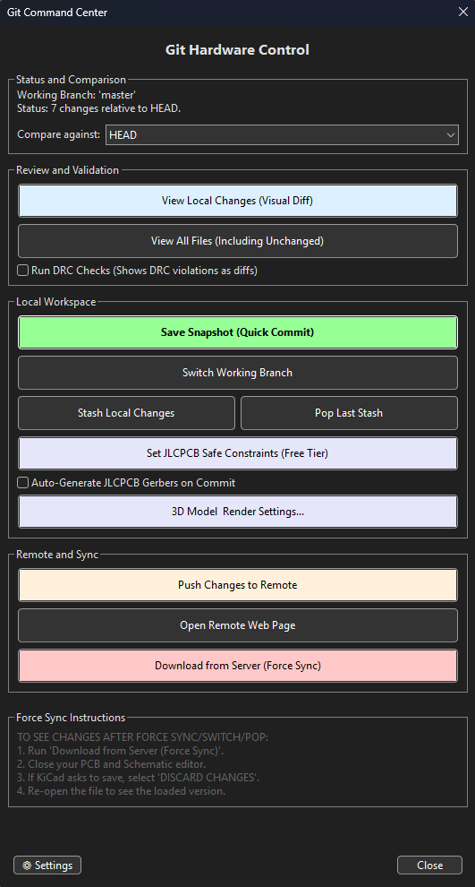
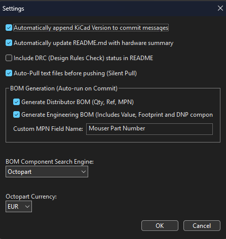
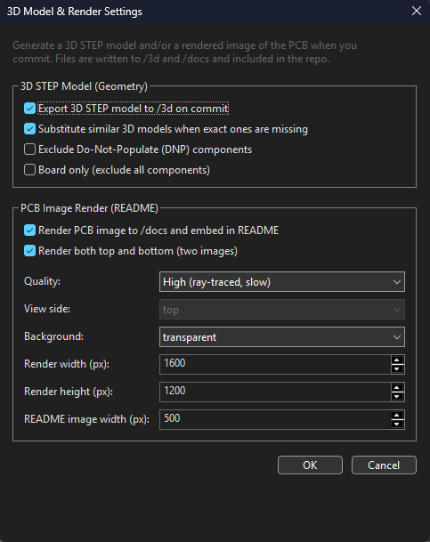

# GitHub Command Center

A Git front-end for the KiCad PCB editor. It wraps common Git operations in a dialog, renders visual diffs of your board and schematic between commits, and can generate documentation and manufacturing files when you commit.

- **Downloads:** https://github.com/mheis22/kicad-github-command-center/releases
- **License:** GPL v3
- **Requirements:** KiCad 7.0+ and Git installed and available on your system `PATH`. PCB image rendering additionally requires KiCad 9.0+.

> **Note:** Git must be installed and on your `PATH` for the plugin to work.

## Features

**Version control**
- Initialize a repository and link it to a remote, or commit into an existing repo.
- Commit dialog with per-file selection, status badges (new / modified / deleted / renamed), and a per-file button to add an entry to `.gitignore` and drop it from the commit.
- Switch branches, stash and pop local changes, push to the remote, and open the remote's web page.
- Force-sync: reset the local workspace to a remote branch (destructive; asks for confirmation first).
- Optional "silent pull" of text files (e.g. `.md`, `.csv`) before pushing; aborts automatically if remote schematic or PCB changes are detected.
- Detects non-ASCII filenames and offers to fix Git's `core.quotePath` setting so commits don't fail.

**Visual diff**
- Renders schematic and PCB changes between the working tree and any commit/branch into a single self-contained HTML file you can open and share.
- Per-layer view, overlay and swipe comparison, colorblind palette, light/dark theme, and optional DRC/ERC and logical (netlist) comparison tabs.

**Documentation & manufacturing (optional, run on commit)**
- Auto-generated README summary block: board dimensions, layer count, component counts (SMD/THT), unique parts, via breakdown, architecture (sheets/buses/power domains), mounting holes, DNP list, TODOs, and tables of core ICs, connectors, oscillators and passives. Optionally includes DRC status.
- BOM export in a distributor format (Qty, Ref, MPN) and/or a more detailed engineering format.
- JLCPCB gerber ZIP generation, and a button that applies a conservative set of JLCPCB design-rule constraints.
- 3D STEP model export (to `/3d`) and rendered PCB images (to `/docs`), embedded centered in the README. See below.
- STEP models, gerbers and renders are skipped on a commit when the PCB file was only re-serialized by KiCad (no real design change), to avoid committing that churn.

## Screenshots

Main window:

  

Shareable HTML visual diff (overlay mode, F.Cu layer):

  

## Installation

1. Download the latest release ZIP from the [releases page](https://github.com/mheis22/kicad-github-command-center/releases).
2. Open KiCad's **Plugin and Content Manager**.
3. Click **Install from File...**
4. Select the downloaded ZIP.

## Usage

1. Open the PCB Editor in KiCad.
2. Click the GitHub Command Center button in the toolbar.
3. If the project isn't a Git repository yet, use **Initialize and Link to Remote** to set it up (optionally pasting a remote URL).
4. Use the dialog to view visual diffs, save a snapshot (commit), switch branches, push, or run the optional generators.

## Settings

Click **⚙ Settings** in the bottom-left of the main window to configure commit-time automation:

  

- **Commit messages:** optionally append the detected KiCad version to each commit message.
- **Auto-README:** update the generated hardware-summary block on commit, optionally including DRC status.
- **Silent Pull:** auto-pull safe text files before pushing.
- **BOM Generation:** enable the distributor and/or engineering BOM, and set the symbol field name used for the manufacturer part number.
- **Search Engine & Currency:** choose the part-search links (Octopart or ComponentSearchEngine) and currency used in the generated README.

## 3D Model & Render

Click **3D Model & Render Settings...** in the main window to configure 3D output generated on commit:

  

- **STEP export** (KiCad 7.0+): writes a `.step` model to `/3d`. Options: substitute similar 3D models when exact ones are missing, exclude DNP components, or export the bare board only.
- **PCB image render** (KiCad 9.0+): writes a rendered image to `/docs` and embeds it, centered, in the README. Supports rendering both top and bottom, quality (basic or ray-traced), background, view side, and image dimensions. The render controls are disabled if the installed KiCad predates 9.0.
