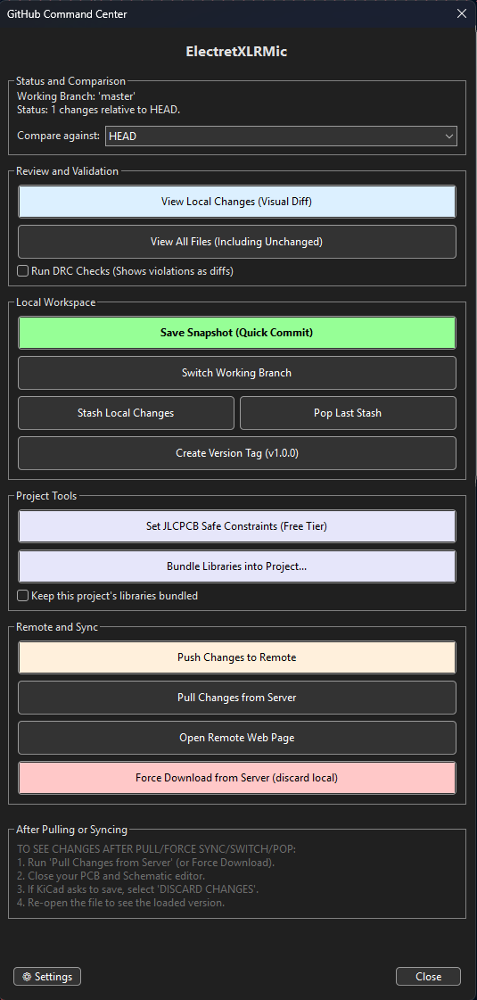
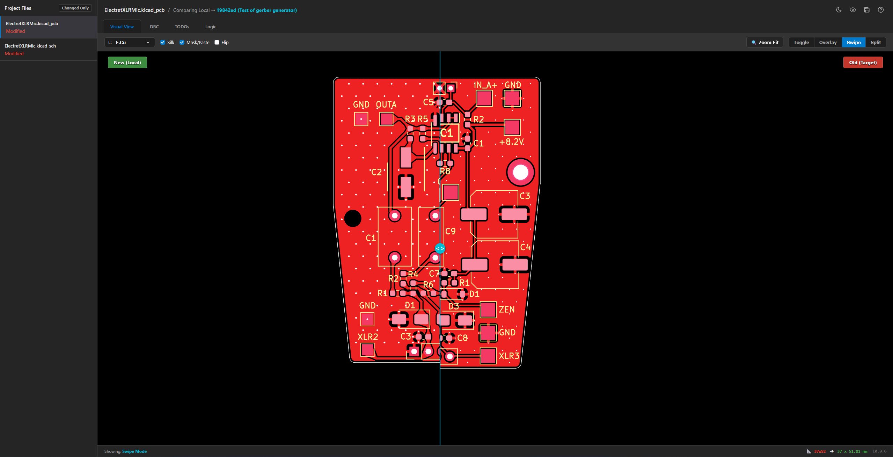
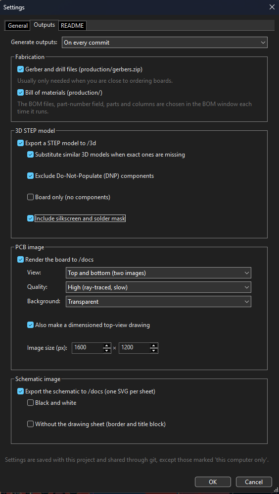

# GitHub Command Center

A Git front-end for the KiCad PCB editor. It runs common Git operations from a dialog, shows visual diffs of the board and schematic between commits, and can generate documentation and manufacturing files on commit.

- **Downloads:** https://github.com/MHeis22/KiCad-GitHub-Command-Center/releases
- **License:** GPL v3
- **Requirements:** KiCad 7.0+ and Git on the system `PATH`. PCB image rendering and STEP silkscreen need KiCad 9.0+.

## Installation

1. Download the latest release ZIP from the [releases page](https://github.com/MHeis22/KiCad-GitHub-Command-Center/releases).
2. Open KiCad's **Plugin and Content Manager**.
3. Click **Install from File...** and select the ZIP.

## Features

**Version control**
- Initialize a repository and link it to a remote, or use an existing one. Can also function fully locally.
- Commit dialog with per-file selection, status badges (new, modified, deleted, renamed) and a per-file button that adds the file to `.gitignore`.
- Switch branches, stash and pop changes, create version tags, push, and open the remote's web page.
- Pull from the server, keeping local commits and uncommitted work. See [Merging](#merging) for what happens when both sides changed the design.
- Force download: replace the local copy with a server branch, with an optional backup branch first.
- Notifies when the server has commits that the local copy doesn't, and offers to pull.
- Optional silent pull of text files (e.g. `.md`, `.csv`) before pushing; skipped if the server has schematic or PCB changes.
- Offers to fix Git's `core.quotePath` setting when file names contain non-ASCII characters.
- Notifies when a newer plugin release is available.

**Visual diff**
- Renders schematic and PCB changes between the working tree and any commit or branch into a single HTML file that can be shared.
- Per-layer view, overlay and swipe comparison, colorblind palette, light and dark themes, and optional DRC/ERC and netlist comparison.

**Documentation and manufacturing** (optional; on commit or on demand)
- README summary: board size, layer count, SMD/THT counts, unique parts, vias, sheets, buses and power domains, mounting holes, DNP list, TODOs, and tables of ICs, connectors, oscillators and passives. Optionally includes the DRC result.
- BOM files: a distributor BOM (Qty, Reference, part number) and/or an engineering BOM.
- Gerber and drill ZIP, plus a button that applies conservative JLCPCB design-rule constraints.
- 3D STEP model (`/3d`), rendered board images and a dimensioned drawing (`/docs`), and schematic SVGs (`/docs`), embedded in the README.
- Board outputs are skipped when the board is empty, or when KiCad only re-saved the file without a design change.

**Team sharing**
- **Bundle Libraries into Project** copies the non-stock symbols, footprints and 3D models the project uses into `/libs` and relinks the design, so the project opens without the author's personal libraries.

## Screenshots

Main window:

  

HTML visual diff (swipe mode, F.Cu layer):

  

## Usage

1. Open the PCB Editor.
2. Click the GitHub Command Center button in the toolbar.
3. For a project that isn't a Git repository yet, click **Initialize and Link to Remote**.
4. Use the main window to review changes, commit, switch branches, push and pull. Project tools (JLCPCB constraints, library bundling, manual file generation) are in their own group.

## Settings

**⚙ Settings** is in the bottom-left of the main window. Settings are stored in the project's `.kicad_git_plugin.json` and committed, so everyone on the project generates the same files. Options marked *this computer only* are stored locally.

  

- **General** *(this computer only)*: append the KiCad version to commit messages; silent pull before pushing.
- **Outputs:** generate on every commit, or only with the **Generate Project Files** button.
  - **Gerbers:** gerber and drill ZIP in `/production`, made from the saved board file (zones refilled). Uses the conventions JLCPCB requires (Protel extensions, merged drill file), which most other fabs also accept.
  - **Bill of materials:** CSVs in `/production`. The files, part-number field, parts and columns are chosen in the BOM window each time it runs.
  - **3D STEP** (KiCad 7.0+): `.step` model in `/3d`. Options: substitute similar 3D models, exclude DNP parts, board only, include silkscreen and solder mask (KiCad 9.0+).
  - **PCB image** (KiCad 9.0+): render in `/docs`. View (including top and bottom as two images), quality, background, image size, and an optional dimensioned top-view drawing.
  - **Schematic image:** one SVG per sheet in `/docs`; optionally black and white or without the drawing sheet.
- **README:** hardware summary on/off, DRC result, widths of the embedded images, and the site (Octopart or ComponentSearchEngine) and currency for part links.

## Merging

When you and the server both have new commits, Pull (or a rejected Push) opens a window listing the files both sides changed. Each row shows the choice as a colored badge: **mine** (blue), **the server's** (orange), or **combined** (green).

- **KiCad design files** (boards, schematics, footprints) always need a choice. *Combine both* is offered when the two sides changed different parts of the file; files where both changed the same lines must be taken from one side.
- **Generated files** (BOM, gerbers, renders, the README summary) are never chosen. They are rebuilt from the merged design at the next commit. Hand-written README text from both sides is kept.
- Before anything is committed, combined files are loaded in KiCad, and the merge is refused if two parts would end up with the same reference (e.g. one side re-annotated and sheets are taken from different sides). A refused or failed merge leaves the repository exactly as it was.
- Footprints whose reference no longer matches their symbol are listed, so you can run *Update PCB from Schematic*.
- The Schematic Editor must be closed during the merge. Afterwards, close the PCB editor **without saving** and reopen it; saving the old board would undo the merge.

## Bundle Libraries into Project

**Bundle Libraries into Project...** is under *Project Tools* in the main window. The Schematic Editor must be closed. A preview lists what will be copied. Stock KiCad parts stay linked to KiCad's libraries unless **Include stock KiCad parts too** is ticked.

- Symbols are written to `libs/<project>.kicad_sym`, footprints to `libs/<project>.pretty`, and custom 3D models to `libs/3dmodels`.
- The project's `sym-lib-table` and `fp-lib-table` get a `<project>` entry, and the schematics and board are relinked to it. The board is saved automatically.
- Original files are backed up to `.bundle_backup/` (git-ignored). If bundling fails, the project is restored automatically.
- Running it again adds only new parts. A part identical to one already bundled reuses it; a different part with the same name gets a new name (e.g. `SOT-23_MyLib`), so existing parts never change. `libs/bundle_sources.json` records which library each part came from.
- On a computer without the original libraries, symbols and footprints are taken from the copies stored in the schematic and board. 3D models only exist as files, so missing ones stay linked to their original path; bundle again on a computer that has them.
- Sheets outside the project folder (shared with other projects) are not changed.
- If the project has the same name as an existing library (e.g. `LED`), the project library is named `<project>_project` so it doesn't hide that library.
- **Keep this project's libraries bundled** stores the choice in the project. Before each commit, parts added from outside the project library are offered for bundling.

Afterwards, reopen the project so KiCad loads the new library tables, then commit `libs/` and the two library tables.
